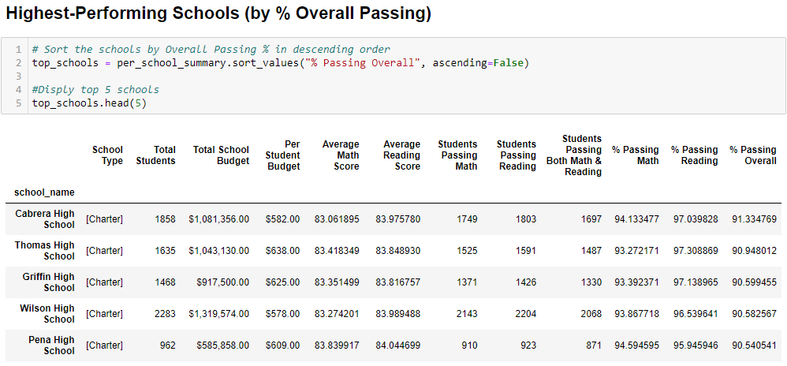
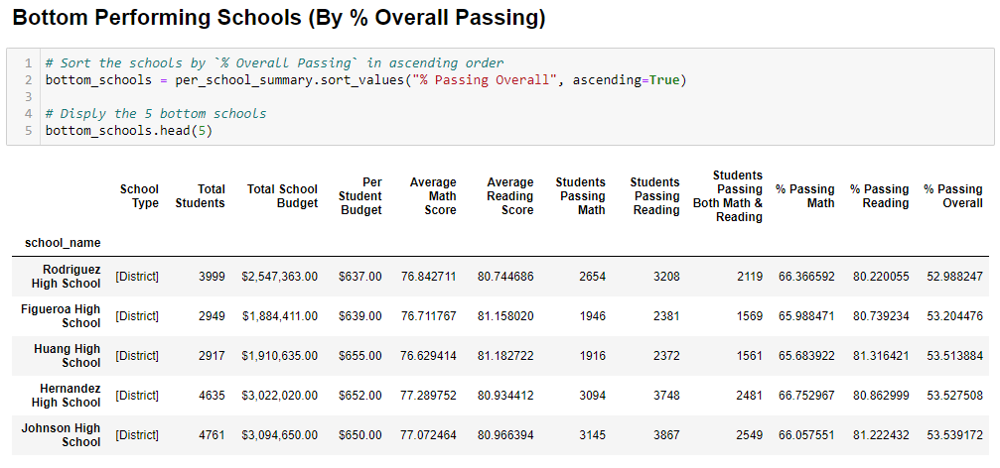
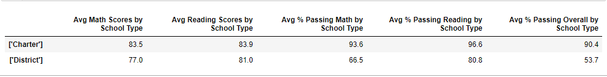
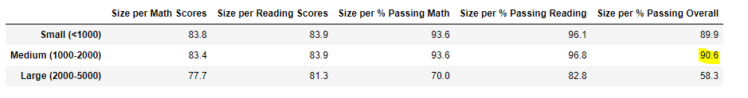
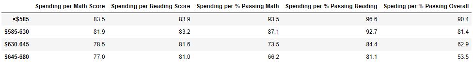

# Pandas_Challenge

In this Chanllenge, I was tasked with analyzing the district-wide standardized test results and to aggregate the data to showcase trends in school performance. 

Pandas library was imported to help create DataFrames which show school standardize tests performance based on different varibles (such as school type, school size, spending per students, etc.)

Analysis:

Top 5 schools are all Charter Schools

Bottom 5 schools are all District Schools

Overall Passing grade is signficantly higher for Charter Schools than District Schools

Meduim size schools had better overall scores than Small sized schools, followed by Large sized schools.

The less money per capita spent, the better the math, reading, and overall scores.

